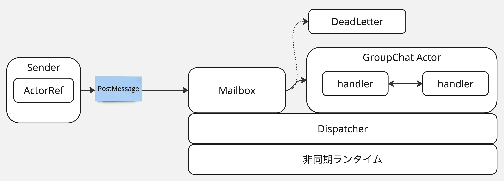

# 【Scala経験者限定！】アクタープログラミングを使ってビジネスチャットの開発に挑戦しよう

https://chatwork.connpass.com/event/320869/

これは、グループチャットを題材し、アクタープログラミングを体験するお題です。

## 当日の目的

以下の課題に取り組むことで、アクターモデルに触れる。すべての課題を解くのは必須ではなく、課題を通して理解を深めることが目的です。楽しくアクターについてディスカッションしながら取り組んでください。

## プログラム

1. 主旨の説明
2. コード概要説明
3. アクターの簡単な説明
4. 取り組み方の説明
5. コードベースの説明
6. チームに分かれて課題に取り組む
7. 振り返り・感想戦

## 想定ユースケース

取り組むのは【課題】のユースケースです。【課題】以外はすでに実装されています。まず最初に実装を理解したほうがいいでしょう。概要は当日説明します。

1. 管理者が、グループチャットを作成する
1. 管理者が、グループチャットの名前を変更する
1. 管理者が、グループチャットにユーザアカウントをメンバーとして追加する
1. 管理者が、グループチャットからメンバーを削除する
1. 【課題1】 メンバーが、グループチャットにメッセージを投稿する
    - この課題だけモデルの実装とテストが追加されているので、すぐにアクターの実装ができる
2. 【課題2】 投稿者が、グループチャットに投稿されたメッセージを編集する
3. 【課題3】 管理者が、グループチャットを削除する

## コードベースについて

- 実装コード
    - ドメインオブジェクトであるGroupChatの実装はほとんど実装されています。課題1は実装されていて、課題2と課題3は未実装です
https://github.com/chatwork/scala-event-challenge-2024/blob/main/actor-programming-challenge/src/main/scala/chatwork/mob/no1/domain/groupChat/GroupChat.scala
    - アクターの実装も、対象課題以外のユースケースに対応するものは実装されています。
https://github.com/chatwork/scala-event-challenge-2024/blob/main/actor-programming-challenge/src/main/scala/chatwork/mob/no1/interfaceAdaptor/groupChat/GroupChatAggregate.scala

- テストコード
    - GroupChatをテストするための、GroupChatSpecがあります。課題1のテストコードはすでにあります。課題2,課題3のテストコードはありません。他の完成済みのテストコードを参考にして実装してください
https://github.com/chatwork/scala-event-challenge-2024/blob/main/actor-programming-challenge/src/test/scala/chatwork/mob/no1/domain/groupChat/GroupChatSpec.scala
    - GroupChatAggregateをテストするための、GroupChatAggregateSpecがあります。課題1,課題2,課題3のテストコードはありません。他の完成済みのテストコードを参考にして実装してください
https://github.com/chatwork/scala-event-challenge-2024/blob/main/actor-programming-challenge/src/test/scala/chatwork/mob/no1/interfaceAdaptor/groupChat/GroupChatAggregateSpec.scala

## 機能仕様について

- 上記にユースケースに対応する具体的な機能仕様については、以下のファイルのScaladocを参照してください。

https://github.com/chatwork/scala-event-challenge-2024/blob/main/actor-programming-challenge/src/main/scala/chatwork/mob/no1/domain/groupChat/GroupChat.scala

## アクターの仕組み(雑な説明)

## モブプログラミングの進め方

- チームの割り振りを決める
- 一人2分ぐらいでさくっと自己紹介(名前, 所属, Scala歴, アクター歴の有無など)
- モブプログラミングを行う
- モブタイマーを使う https://mobti.me/
  - 適当なチーム名を決めて、タイマーを作る。URLをチームメンバーに共有してください。
  - Show member from からメンバーを使う
  - Timer settingsのDuration を7分に設定する
  - ドライバーの方がStartボタンを押す
  - 時間がきたら交代する
- 自分の順番になったら、
  - git pullする
  - タイマーをスタートしてモブプログラミングを開始する
  - タイムアップしたら、git pushする
  - 順番を交代する
